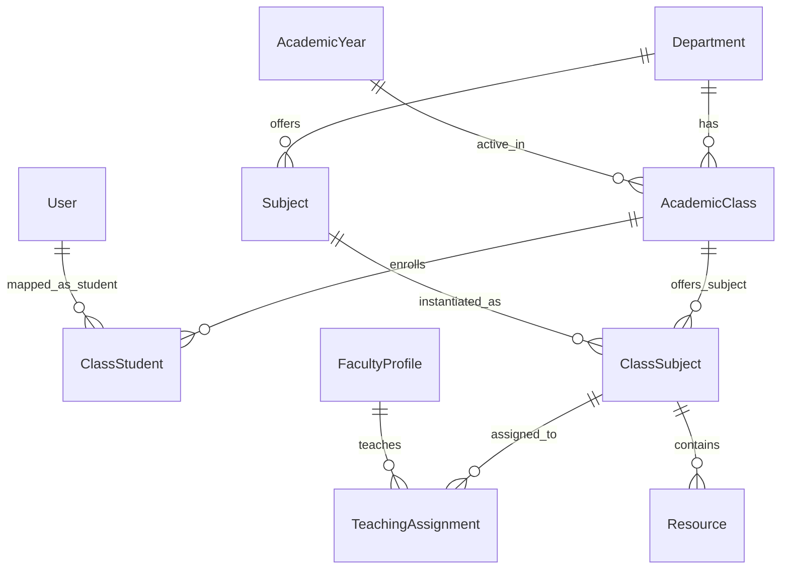
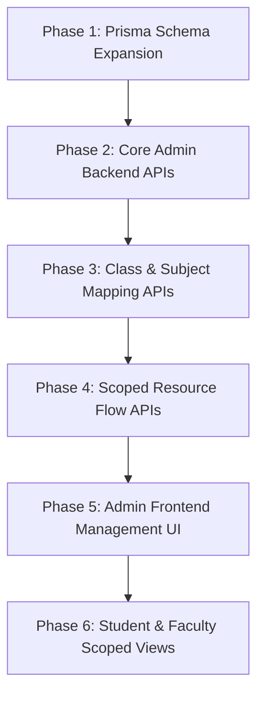

# Acadify Platform Audit — Admin Module & Data Architecture

> [!IMPORTANT]
> **INSPECTION-ONLY AUDIT**: No repository files, database schemas, or migrations were modified during this inspection.

---

## Part 1 — Prisma Database Audit

### Comprehensive Schema Breakdown (`apps/backend/prisma/schema.prisma`)

The database consists of **7 Prisma Models** and **3 Enums** configured for PostgreSQL (hosted on Supabase).

#### 1. Enums
- **`Role`**: `STUDENT`, `FACULTY`, `ADMIN`
- **`ProjectStatus`**: `PROPOSED`, `APPROVED`, `IN_PROGRESS`, `COMPLETED`, `PUBLISHED`
- **`ResourceType`**: `PDF`, `PPT`, `DOCX`

#### 2. Models & Field Specifications

| Model | Field | Type | Attributes / Constraints | Notes |
| :--- | :--- | :--- | :--- | :--- |
| **`User`** | `id` | `String` | `@id @default(uuid())` | Primary key |
| | `email` | `String` | `@unique` | User login handle |
| | `passwordHash` | `String` | | Bcrypt hashed password |
| | `name` | `String` | | Full name |
| | `role` | `Role` | Enum | `STUDENT`, `FACULTY`, `ADMIN` |
| | `bio` | `String?` | Nullable | Profile bio |
| | `programme` | `String?` | Nullable | e.g. "B.Tech CSE" |
| | `studentId` | `String?` | Nullable | e.g. "CH.EN.U4CCE23041" |
| | `academicInterests` | `String[]` | Array | default empty array |
| | `careerInterests` | `String[]` | Array | default empty array |
| | `skills` | `String[]` | Array | default empty array |
| | `githubUrl` | `String?` | Nullable | External link |
| | `linkedinUrl` | `String?` | Nullable | External link |
| | `portfolioUrl` | `String?` | Nullable | External link |
| | `currentSemester` | `Int?` | Nullable | Stored directly on User |
| | `departmentId` | `String?` | Nullable, FK -> `Department.id` | Belongs to department |
| | `createdAt` | `DateTime` | `@default(now())` | Creation timestamp |
| **`Department`** | `id` | `String` | `@id @default(uuid())` | Primary key |
| | `name` | `String` | | e.g. "Computer Science Engineering" |
| | `code` | `String` | `@unique` | e.g. "CSE" |
| **`Subject`** | `id` | `String` | `@id @default(uuid())` | Primary key |
| | `name` | `String` | | e.g. "Data Structures" |
| | `code` | `String` | `@unique` | e.g. "CSE201" |
| | `semester` | `Int` | Scalar | Raw integer semester |
| | `departmentId` | `String` | FK -> `Department.id` | Linked department |
| **`FacultyProfile`** | `id` | `String` | `@id @default(uuid())` | Primary key |
| | `userId` | `String` | `@unique`, FK -> `User.id` | 1-to-1 relation with User |
| | `designation` | `String?` | Nullable | e.g. "Associate Professor" |
| | `bio` | `String?` | Nullable | Faculty bio |
| | `qualification` | `String?` | Nullable | e.g. "Ph.D. in Computer Vision" |
| | `experienceYears` | `Int?` | Nullable | Total years of experience |
| | `researchInterests` | `String[]` | Array | Array of research topics |
| | `currentResearch` | `String?` | Nullable | Active research description |
| | `skills` | `String[]` | Array | Technical skills |
| | `specialization` | `String?` | Nullable | Domain specialization |
| | `preferredDomains` | `String[]` | Array | Domain preferences for mentoring |
| | `preferredTechnologies`| `String[]` | Array | Tech stack preferences |
| | `facultyWebpageUrl`| `String?` | Nullable | University webpage URL |
| | `googleScholarUrl` | `String?` | Nullable | Scholar link |
| | `orcidUrl` | `String?` | Nullable | ORCID identifier link |
| | `linkedinUrl` | `String?` | Nullable | LinkedIn link |
| | `availableForProjects`| `Boolean` | `@default(true)` | Mentoring availability toggle |
| | `maxStudents` | `Int` | `@default(4)` | Max student capacity |
| | `currentStudents` | `Int` | `@default(0)` | Currently assigned students |
| **`Project`** | `id` | `String` | `@id @default(uuid())` | Primary key |
| | `title` | `String` | | Project title |
| | `description` | `String` | | Project description |
| | `technologies` | `String[]` | Array | Tech stack array |
| | `domain` | `String` | | Domain tag |
| | `status` | `ProjectStatus`| `@default(PROPOSED)` | Workflow status |
| | `githubUrl` | `String?` | Nullable | Code repo |
| | `liveDemoUrl` | `String?` | Nullable | Live URL |
| | `imageUrl` | `String?` | Nullable | Project preview image |
| | `startDate` | `DateTime?` | Nullable | Start date |
| | `expectedCompletion`| `DateTime?` | Nullable | End date |
| | `createdAt` | `DateTime` | `@default(now())` | Timestamp |
| | `updatedAt` | `DateTime` | `@updatedAt` | Timestamp |
| | `mentorId` | `String?` | Nullable, FK -> `FacultyProfile.id`| Linked faculty mentor |
| **`ProjectStudent`**| `id` | `String` | `@id @default(uuid())` | Primary key |
| | `projectId` | `String` | FK -> `Project.id` | Linked project |
| | `userId` | `String` | FK -> `User.id` | Linked student user |
| | Constraints | | `@@unique([projectId, userId])` | Prevents duplicate student assignment |
| **`Resource`** | `id` | `String` | `@id @default(uuid())` | Primary key |
| | `title` | `String` | | Resource title |
| | `fileUrl` | `String` | | Storage file link |
| | `type` | `ResourceType`| Enum | `PDF`, `PPT`, `DOCX` |
| | `academicYear` | `String` | Scalar | Loose string (e.g., "2026-27") |
| | `subjectId` | `String` | FK -> `Subject.id` | Linked subject |
| | `uploadedById` | `String` | FK -> `User.id` | Uploader (Faculty/User) |
| | `createdAt` | `DateTime` | `@default(now())` | Timestamp |

---

## Part 2 — Usage of Core Models Across the Repository

### Usage Matrix

| Entity / Field | Created In | Updated In | Queried In | API Route | Frontend Page |
| :--- | :--- | :--- | :--- | :--- | :--- |
| **`User`** | `auth.service.ts` (`signup`), `seed.ts`, `import-faculty.ts` | `profiles.service.ts` (`updateMine`) | `auth.service.ts` (`login`, `refresh`), `profiles.service.ts` (`getMine`) | `/auth/signup`, `/auth/login`, `/auth/refresh`, `/profiles/me` | `/login`, `/dashboard/profile` |
| **`Department`** | `seed.ts` | Nowhere | `profiles.service.ts` (`getMine`), `mentor-recommendation.service.ts` | Indirectly via `/profiles/me`, `/mentor-recommendation` | `/dashboard/profile`, `/dashboard/mentor-recommendation` |
| **`Subject`** | `seed.ts` | Nowhere | Nowhere in endpoints | No API implemented | `/dashboard/admin/subjects` (Placeholder) |
| **`FacultyProfile`**| `seed.ts`, `import-faculty.ts` | `profiles.service.ts` (`updateMine`) | `profiles.service.ts`, `mentor-recommendation.service.ts` | `/profiles/me`, `/mentor-recommendation` | `/dashboard/profile`, `/dashboard/mentor-recommendation` |
| **`Project`** | `projects.service.ts` (`createForStudent`), `seed.ts` | `projects.service.ts` (`updateForStudent`) | `projects.service.ts` (`findAllForStudent`, `findOneForStudent`), `profiles.service.ts` | `/projects`, `/projects/:id` | `/dashboard/projects`, `/dashboard/profile` |
| **`ProjectStudent`**| `projects.service.ts`, `seed.ts` | Nowhere | `projects.service.ts`, `profiles.service.ts` | `/projects` | `/dashboard/projects`, `/dashboard/profile` |
| **`Resource`** | Nowhere in backend | Nowhere | Nowhere | No API implemented | `/dashboard/resources` (Placeholder) |
| **`departmentId`** | `auth.service.ts`, `seed.ts` | Nowhere | `users.service.ts`, `profiles.service.ts` | `/auth/signup`, `/profiles/me` | `/login` |
| **`currentSemester`**| `auth.service.ts`, `seed.ts` | Nowhere | `users.service.ts`, `profiles.service.ts` | `/auth/signup`, `/profiles/me` | `/dashboard/profile` |
| **`academicYear`** | Nowhere in code | Nowhere | Nowhere | No API implemented | Nowhere |
| **`mentorId`** | `seed.ts` | Nowhere | `projects.service.ts` | `/projects` | `/dashboard/projects` |
| **`subjectId`** | Nowhere in code | Nowhere | Nowhere | No API implemented | Nowhere |
| **`uploadedById`** | Nowhere in code | Nowhere | Nowhere | No API implemented | Nowhere |

---

## Part 3 — Admin Module Audit

### Existing Status
- **Backend Admin Controller**: Only contains a dummy endpoint in `AuthController`:
  ```ts
  @Get('admin-only')
  @UseGuards(JwtAuthGuard, RolesGuard)
  @Roles(Role.ADMIN)
  adminOnlyRoute() {
    return { message: 'You are an admin, welcome' };
  }
  ```
- **Backend Admin Service / Module**: Does NOT exist (`apps/backend/src/admin` is completely missing).
- **Backend Admin Functionality Status**:
  - [x] Admin Role Enum & Guard check (`RolesGuard`, `@Roles(Role.ADMIN)`): **WORKING**
  - [ ] Admin User Creation (Students & Faculty): **MISSING**
  - [ ] Admin Department Management: **MISSING**
  - [ ] Admin Academic Year Management: **MISSING**
  - [ ] Admin Class / Section Management: **MISSING**
  - [ ] Admin Student-to-Class Mapping: **MISSING**
  - [ ] Admin Subject Management & Class Mapping: **MISSING**
  - [ ] Admin Faculty-to-Subject/Class Assignment: **MISSING**
- **Frontend Admin Pages**:
  - `/dashboard/admin/users/page.tsx` -> Returns `"Coming soon."`
  - `/dashboard/admin/departments/page.tsx` -> Returns `"Coming soon."`
  - `/dashboard/admin/subjects/page.tsx` -> Returns `"Coming soon."`
  - `/dashboard/admin/analytics/page.tsx` -> Returns `"Coming soon."`

---

## Part 4 — Student Data Model Audit

### How Students Are Currently Represented
- **Model**: `User` table with `role = Role.STUDENT`.
- **Existing Fields**:
  - `departmentId`: Foreign key to `Department`.
  - `currentSemester`: Simple integer (e.g. `5`).
  - `studentId`: String (e.g. `"CH.EN.U4CCE23041"`).
  - `programme`: String (e.g. `"B.Tech CCE"`).
  - `academicInterests`, `careerInterests`, `skills`: String arrays.
- **Missing Concepts**:
  - No `AcademicYear` entity.
  - No `AcademicClass` or `Section` entity (e.g., CCE / Year 1 / Section A).
  - No `YearOfStudy` tracking (e.g., 1st Year, 2nd Year).
  - No historical class enrollment record (mapping student to a specific class per academic year).

---

## Part 5 — Faculty Data Model Audit

### How Faculty Are Currently Represented
- **Model**: `User` (`role = Role.FACULTY`) linked 1-to-1 to `FacultyProfile`.
- **Existing Profile Fields**:
  - `designation`, `qualification`, `experienceYears`, `researchInterests`, `currentResearch`, `skills`, `specialization`, `preferredDomains`, `preferredTechnologies`, `availableForProjects`, `maxStudents`, `currentStudents`, social/scholar URLs.
- **AI Integration**:
  - When `FacultyProfile` is updated via `PATCH /profiles/me`, `ProfilesService.reembedFacultyProfile()` sends the updated bio/skills/research text to the Python AI service at `POST /ai/faculty-profile/embed`.
  - Python AI service updates vectors in ChromaDB collection `faculty_profiles`.
- **Subject / Class Linkages**:
  - Faculty are currently **NOT** linked to any `Subject`, `Class`, or `Section` in either Prisma or NestJS.

---

## Part 6 — Subject Data Model Audit

### Existing Subject Architecture
- **Model**: `Subject` table exists in Prisma (`id`, `name`, `code`, `semester`, `departmentId`).
- **Scope**: Tied directly to `Department` via `departmentId`.
- **Semester**: Stored as a raw `Int` directly on `Subject`.
- **Missing Elements**:
  - Subjects are **not** linked to any Class/Section.
  - Subjects are **not** assigned to any Faculty.
  - No APIs exist to create, list, update, or delete subjects.

---

## Part 7 — Resource Flow Trace & Audit

### Existing Resource Setup
- **Model**: `Resource` (`id`, `title`, `fileUrl`, `type`, `academicYear`, `subjectId`, `uploadedById`).
- **Current Execution**: Zero endpoints in backend; Frontend `/dashboard/resources` returns "Coming soon".

### Audit against Requirement Scenario:
> *Faculty X uploads a resource for Academic Year 2026-27, Class CCE 1A, Subject Engineering Mathematics.*

- **Flaw in Current Model**:
  1. `Resource` links directly to `Subject` and `User` (`uploadedById`), storing `academicYear` as a loose string (`"2026-27"`).
  2. `Resource` has **no link to a Class or Section** (e.g., Section A vs Section B).
  3. If Subject "Engineering Mathematics" is taught to multiple sections (CCE 1A and CCE 1B), a resource uploaded for CCE 1A is currently associated with `subjectId` only, making it globally visible to all students taking that subject regardless of section or academic year.
  4. There is no mapping table to restrict student visibility to resources of their assigned class/section.

---

## Part 8 — Existing API Structure Audit

```
apps/backend/src/
├── app.module.ts
├── auth/
│   ├── auth.controller.ts  [POST /auth/signup, POST /auth/login, POST /auth/refresh, GET /auth/me, GET /auth/admin-only]
│   ├── auth.service.ts
│   └── guards/ (jwt-auth.guard.ts, roles.guard.ts)
├── profiles/
│   ├── profiles.controller.ts [GET /profiles/me, PATCH /profiles/me]
│   └── profiles.service.ts
├── projects/
│   ├── projects.controller.ts [GET /projects, GET /projects/:id, POST /projects, PATCH /projects/:id, DELETE /projects/:id]
│   └── projects.service.ts
├── mentor-recommendation/
│   ├── mentor-recommendation.controller.ts [POST /mentor-recommendation]
│   └── mentor-recommendation.service.ts
├── users/
│   └── users.service.ts
└── prisma/
    └── prisma.service.ts
```

---

## Part 9 — Existing Frontend Structure Audit

```
apps/frontend/app/
├── login/page.tsx               [Functional User Login]
├── dashboard/
│   ├── page.tsx                 [Dashboard Overview]
│   ├── profile/page.tsx         [Functional Student/Faculty Profile Management]
│   ├── projects/page.tsx        [Functional Student Projects Portfolio Workspace]
│   ├── mentor-recommendation/   [Functional AI Mentor Match Interface]
│   ├── resources/page.tsx       [Placeholder: "Coming soon"]
│   └── admin/
│       ├── users/page.tsx       [Placeholder: "Coming soon"]
│       ├── departments/page.tsx [Placeholder: "Coming soon"]
│       ├── subjects/page.tsx    [Placeholder: "Coming soon"]
│       └── analytics/page.tsx   [Placeholder: "Coming soon"]
```

---

## Part 10 — Schema Gap Analysis

To fulfill all requirements of the Admin module without breaking existing features, the schema requires 5 structural additions:



### Key Recommendations
1. **Reuse Untouched**:
   - `User`, `FacultyProfile`, `Project`, `ProjectStudent`, `Department` (keep all existing fields and IDs intact to avoid breaking AI embeddings and authentication).
2. **New Entities Required**:
   - `AcademicYear`: `id`, `year` (e.g. "2026-27"), `startDate`, `endDate`, `isCurrent` (Boolean).
   - `AcademicClass`: `id`, `name` (e.g. "CCE 1A"), `departmentId`, `yearOfStudy` (Int: 1..4), `section` (String: "A"), `academicYearId`.
   - `ClassStudent`: `id`, `classId`, `studentId` (`User.id`), `academicYearId` (unique on `[classId, studentId]`).
   - `ClassSubject`: `id`, `classId`, `subjectId`, `academicYearId` (unique on `[classId, subjectId]`).
   - `TeachingAssignment`: `id`, `classSubjectId`, `facultyId` (`FacultyProfile.id`), `academicYearId`.
3. **Resource Modification**:
   - Connect `Resource` to `classSubjectId` (or `teachingAssignmentId`) instead of bare `subjectId` + string `academicYear`.

---

## Part 11 — Data Migration Risk Assessment

> [!WARNING]
> High-risk touchpoints to preserve during future schema migrations:

1. **AI Vector Database Integrity (ChromaDB)**:
   - `seed_faculty_v2.py` matches `FacultyProfile.id` with `prisma/faculty-id-mapping.csv` and ChromaDB vector IDs.
   - Any deletion or re-generation of `FacultyProfile.id` values will sever the link between NestJS PostgreSQL records and ChromaDB vector embeddings.
2. **Authentication Payloads**:
   - JWT tokens embed `sub` (`User.id`), `email`, and `role`. Changing user IDs invalidates existing sessions.
3. **Existing Seed Data**:
   - Seed script creates `Dr. Devi Sowjanya` (ADMIN), `Dr. Priya Sharma` (FACULTY), and `Arjun Kumar` (STUDENT).

---

## Part 12 — Files That Would Need Changes (Future Implementation)

### Backend (`apps/backend/src`)
- `prisma/schema.prisma` (Add new relational models)
- `app.module.ts` (Register new Admin & Operational modules)
- `admin/admin.module.ts`, `admin.controller.ts`, `admin.service.ts` (**NEW**)
- `departments/departments.controller.ts`, `departments.service.ts` (**NEW**)
- `classes/classes.controller.ts`, `classes.service.ts` (**NEW**)
- `subjects/subjects.controller.ts`, `subjects.service.ts` (**NEW**)
- `resources/resources.controller.ts`, `resources.service.ts` (**NEW**)

### Frontend (`apps/frontend/app`)
- `/dashboard/admin/users/page.tsx` (Replace placeholder with User creation forms)
- `/dashboard/admin/departments/page.tsx` (Replace placeholder with Department manager)
- `/dashboard/admin/subjects/page.tsx` (Replace placeholder with Subject & Class-mapping UI)
- `/dashboard/admin/classes/page.tsx` (**NEW** Class/Section manager)
- `/dashboard/resources/page.tsx` (Replace placeholder with Scoped Resource Library)

---

## Part 13 — Existing Features That Must Not Break

1. **JWT Auth Flow** (`/auth/login`, `/auth/refresh`, `authFetch`).
2. **AI Mentor Recommendation** (`POST /mentor-recommendation` -> Python `/ai/mentor-recommendation`).
3. **Faculty Auto Re-Embedding** (`PATCH /profiles/me` -> Python `/ai/faculty-profile/embed`).
4. **Student Projects Workspace** (`/projects` CRUD operations).
5. **Profile Strength & Editing** (`/dashboard/profile`).

---

## Part 14 — Recommended Implementation Order



1. **Phase 1: Prisma Schema Expansion**: Add `AcademicYear`, `AcademicClass`, `ClassStudent`, `ClassSubject`, `TeachingAssignment`, and update `Resource`. Run migration.
2. **Phase 2: Core Admin Backend APIs**: Build Admin Guard, Admin User Management (Create Student/Faculty with temp password), Department CRUD, Academic Year CRUD.
3. **Phase 3: Class & Subject Mapping APIs**: Create Classes/Sections, Map Students to Class, Map Subjects to Class, Assign Faculty to Class-Subject.
4. **Phase 4: Scoped Resource Flow APIs**: Implement Resource upload for faculty (scoped to assigned class-subjects) and resource query for students (scoped to enrolled class-subjects).
5. **Phase 5: Admin Frontend Management UI**: Replace placeholder pages under `/dashboard/admin/` with management interfaces for Users, Departments, Classes, and Mappings.
6. **Phase 6: Student & Faculty Scoped Views**: Connect `/dashboard/resources` to fetch scoped class resources for students and active teaching assignments for faculty.

---

## Part 15 — Target Architecture Diagrams

### 1. Student Hierarchy Flow
```
Department (e.g., Computer Science Engineering)
    ↓
Academic Year (e.g., 2026-27)
    ↓
Academic Class / Section (e.g., CCE - 1st Year - Section A)
    ↓
Students (e.g., Arjun Kumar)
```

### 2. Faculty & Teaching Assignment Flow
```
Department (e.g., Computer Science Engineering)
    ↓
Subjects (e.g., Engineering Mathematics)
    ↓
Class Subject / Offering (e.g., Engg Maths → CCE 1A → 2026-27)
    ↓
Teaching Assignment
    ↓
Faculty (e.g., Dr. Priya Sharma)
```

### 3. Scoped Resource Flow
```
Class Subject / Offering (e.g., Engg Maths → CCE 1A → 2026-27)
    ↓
Teaching Assignment (Faculty Uploads Resource)
    ↓
Resources (PDF / PPT / DOCX)
    ↓
Enrolled Students Only (CCE 1A Students)
```
